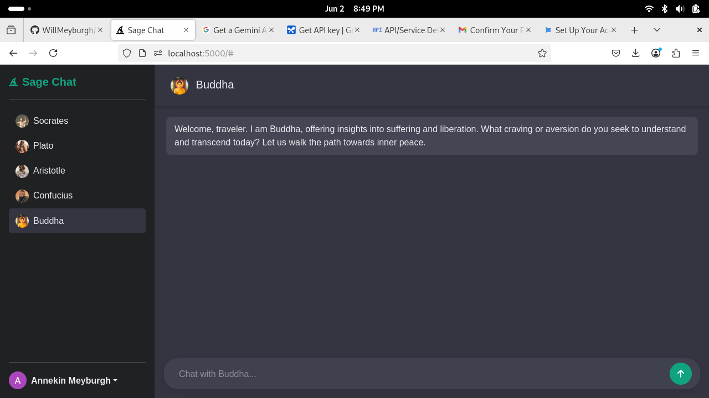

# sage-chat

## Project Description
This project is a web application built with Flask that allows users to chat with different "sages" (AI models). It includes user authentication, a SQLite database for user and sage information, and a simple chat interface.

## Environment Variables

To run this project, the following environment variables are required in a `.env` file in the root directory:

| Variable Name     | Description                                                              |
|-------------------|--------------------------------------------------------------------------|
| `FLASK_SECRET_KEY`| A secret key used by Flask for session management and security.          |
| `GEMINI_API_KEY`  | Your API key for accessing the Gemini (Google AI) model.                 |
| `GOOGLE_CLIENT_ID`| Your Google Client ID for Google OAuth authentication.                   |
